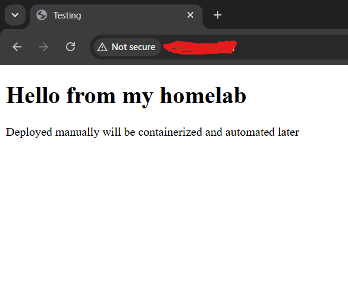

# Project 1: Manual Deployment

## What this is

A manual deployment of a simple static site to a Linux server, done without any automation — no Docker, no CI/CD, no Infrastructure as Code. The goal of this project isn't the site itself; it's understanding **exactly what a deployment pipeline automates**, by doing every step by hand first.

This is Project 1 in a series building toward a full DevOps/cloud pipeline:
- **Project 1:** manual deploy — understand the fundamentals
- **Project 2:** containerize the same app with Docker + deploy to a local Kubernetes cluster (k3s)
- **Project 3:** automate build/test/scan/deploy with a CI/CD pipeline
- **Project 4:** provision equivalent infrastructure on AWS with Terraform, add monitoring

## Architecture

```
Browser (host machine)
      |
      | HTTP :80
      v
Ubuntu Server VM (VMware, NAT network)
      |
      v
  Nginx (web server)
      |
      v
  /var/www/html (static site content)
```

## Stack

- **Host:** Windows, VMware Workstation Pro
- **VM:** Ubuntu Server (NAT networking)
- **Web server:** Nginx
- **Source control:** Git / GitHub

## Steps taken

1. **Provisioned an Ubuntu Server VM** in VMware Workstation Pro, using NAT networking.
2. **Enabled SSH access** (`openssh-server`) so the VM could be managed remotely from the host via terminal or VS Code Remote-SSH, rather than working directly in the VM console.
3. **Updated the system** (`sudo apt update && sudo apt upgrade -y`) to ensure packages installed from a current index, avoiding outdated or vulnerable versions.
4. **Installed Nginx** (`sudo apt install nginx -y`), a web server chosen for its event-driven architecture (handles many concurrent connections efficiently) and its role as the standard "front door" component in most real-world architectures — web server, reverse proxy, load balancer, and TLS terminator in one.
5. **Verified the service** was running (`systemctl status nginx`) and reachable from the host browser over the NAT network using its IP Address — confirming the full path from browser → network → VM → Nginx process, not just that the process existed.
6. **Created a separate GitHub repo** for the site content, simulating a developer handing off finished code — rather than hand-authoring the site directly on the server, which wouldn't reflect a real DevOps workflow.
7. **Cloned the repo onto the server** into a temporary directory (`/tmp`), then copied just the site's content (not the `.git` history) into Nginx's document root (`/var/www/html`) — keeping the web root clean of version-control metadata, consistent with how real deploy tooling separates "build artifact" from "source repo."
8. **Verified the deployed site** was reachable from the host browser at the VM's IP. Type the IP address into the host browser (chrome). You can check your server IP using (ip a)

## Why manual first

Every later project in this series automates one or more of these steps. Doing them by hand first means the automation (Docker, CI/CD, Terraform) is understood as *"the thing that does what I just did, reliably and repeatedly"* — not unfamiliar tooling learned in isolation.

## What I'd change for a real production deployment

- Use a proper deploy user with least-privilege permissions rather than `sudo` for file operations.
- Automate this entire flow via CI/CD (Project 3) rather than manual SSH + copy.
- Use `rsync` instead of `cp` for any future manual syncs, since it only transfers changed files.
- Add a firewall (`ufw`) policy explicitly allowing only required ports (80/443/22), rather than relying on defaults.

## Screenshot



# Project 2: Containerization with Docker + Docker Compose

Building on Project 1's manual deployment, this project containerizes the same site with Docker, adds a Postgres database, connects both over a dedicated Docker network, and finally consolidates the entire multi-container setup into a single declarative `docker-compose.yml` file. Along the way, this project also hardens SSH access with key-based authentication, replacing the password login used in Project 1.

This is Project 2 in a series building toward a full DevOps/cloud pipeline:
- **Project 1:** manual deploy — understand the fundamentals
- **Project 2 (this one):** containerize with Docker + Compose, add a database, harden SSH access
- **Project 3:** automate build/test/scan/deploy with a CI/CD pipeline
- **Project 4:** provision equivalent infrastructure on AWS with Terraform, add monitoring

## Architecture

```
Browser (host machine)
      |
      | HTTP :8080
      v
Ubuntu Server VM (VMware, NAT network)
      |
      v
  docker-compose (portfolio-net, bridge network)
      |
      +-- web container (Nginx 1.18.0, built from Dockerfile)
      |         |
      |         | resolves "portfolio-db" via Docker DNS
      |         v
      +-- db container (Postgres 16)
                |
                v
          pgdata (named volume, persists independently of container lifecycle)
```

## Stack

- **Host:** Windows, VMware Workstation Pro
- **VM:** Ubuntu Server (NAT networking)
- **Containerization:** Docker, Docker Compose (v1)
- **Web server (containerized):** Nginx 1.18.0 — pinned to match the version manually installed in Project 1
- **Database:** Postgres 16
- **Source control:** Git / GitHub

## Part A — SSH key-based authentication (hardening access)

Before continuing infrastructure work, password-based SSH login was replaced with key-based authentication:

1. Generated an SSH key pair on the host machine: `ssh-keygen -t ed25519`
2. Copied the public key to the VM's `~/.ssh/authorized_keys`:
   ```
   cd /
   mkdir ~/.ssh
   cd ~/.ssh
   nano authorized_keys
   paste your public key into nano and save
   ```
3. Set correct permissions on the VM (SSH silently refuses to trust files with overly permissive access):
   ```
   chmod 700 ~/.ssh
   chmod 600 ~/.ssh/authorized_keys
   ```
4. Verified passwordless login: `ssh <username>@<vm-ip>` now connects directly, with no password prompt.

**Why this matters:** in real infrastructure, servers reboot and come back online without a human present to type a password. Key-based auth is what makes automated, unattended reconnection possible — the account password still exists for console/local access, but SSH authentication no longer depends on it.

## Part B — Containerizing the site

1. **Installed Docker** (`docker.io`) and added the user to the `docker` group to run commands without `sudo`.
    sudo apt update
    sudo apt install docker.io -y
    sudo systemctl enable docker
    sudo systemctl start docker
    sudo systemctl status docker
    sudo usermod -aG docker $USER

2. **Wrote a Dockerfile**, pinned to `nginx:1.18.0` to match the version installed manually in Project 1 (avoiding `latest`, which is not reproducible):
   ```dockerfile
   FROM nginx:1.18.0
   COPY . /usr/share/nginx/html
   EXPOSE 80
   ```
   Note: the content path here (`/usr/share/nginx/html`) is the official Nginx **image's** convention — different from `/var/www/html`, which is the bare-metal Ubuntu/Apache convention used in Project 1. Container image paths are defined by the image maintainer, not a universal OS standard.
3. **Built and tagged the image**: `docker build -t portfolio-site:v1 .`
4. **Ran the container** with an explicit port mapping (`-p 8080:80`) so it could run alongside the still-active bare-metal Nginx from Project 1 without conflict — proof of containerization's isolation.

## Part C — Adding a database and proving persistence

1. Ran a Postgres container with a **named volume** (`pgdata:/var/lib/postgresql/data`).
2. Created a test table and row inside it.
3. Deleted the container entirely (`docker rm -f portfolio-db`) and recreated it, reattaching the same volume.
4. Confirmed the data survived — proving that container lifecycle and data persistence are decoupled when volumes are used correctly.

    CREATE TABLE test (id SERIAL PRIMARY KEY, note TEXT);
    INSERT INTO test (note) VALUES ('hello from my homelab');
    SELECT * FROM test;
You should see your row returned. Exit with \q.

## Part D — Networking debugging (real issue encountered and resolved)

After creating a dedicated bridge network (`portfolio-net`) and reattaching both containers, a connectivity test failed:

```
curl: (6) Could not resolve host: portfolio-db
```

**Diagnosis process:**
1. Tried `ping` first — failed with `executable file not found`, which was a missing-tool issue (minimal Nginx image), not a network issue. Read the error literally rather than assuming.
2. Switched to `curl -v telnet://portfolio-db:5432` to test raw TCP connectivity without relying on ping being present.
3. Used `docker network inspect portfolio-net` as the authoritative source of truth for what Docker actually knew about the network — rather than continuing to guess from the outside.
4. This revealed `portfolio-db` was **not** listed under the network's containers at all — it had been created before `--network portfolio-net` was consistently applied, and Docker `run` flags only take effect at container creation time, not retroactively.
5. Fixed with `docker network connect portfolio-net portfolio-db`, then re-verified with `getent hosts portfolio-db` and a successful `curl` connection to port 5432.

**Root cause:** manually re-running `docker run` commands makes it easy to forget a flag on a recreate, since nothing enforces consistency between runs. This is one of the direct motivations for Part E below.

## Part E — Consolidating into Docker Compose

All of the above (network, both containers, volume, environment variables, port mapping) was rewritten into a single `docker-compose.yml`, so the entire setup is declared once and applied identically every time — eliminating the class of bug found in Part D.

Brought up with `docker-compose up -d`. The existing `pgdata` volume was reused (declared `external: true`) to prove that data created before the migration to Compose survived the transition intact.

## Why this project matters

Project 1 proved the manual steps and their purpose. This project shows the same result achieved through increasingly reliable methods: manual `docker run` commands (flexible, but error-prone on recreation) → a single declarative Compose file (consistent, versionable, and the actual real-world standard for local multi-container development). The networking bug in Part D is a genuine example of why declarative configuration is preferred over imperative, manually repeated commands.

## What I'd change for a real production deployment

- Add a healthcheck to the `db` service so `depends_on` waits for Postgres to be *ready*, not just *started*.
- Move secrets (`POSTGRES_PASSWORD`) out of the Compose file and into a proper secrets manager or `.env` file excluded from version control.
- Use a private container registry rather than building locally, once this moves into a CI/CD pipeline (Project 3).